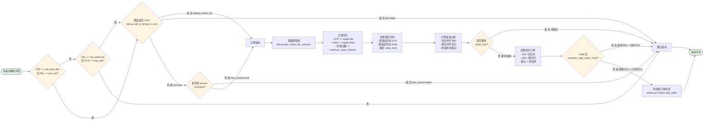
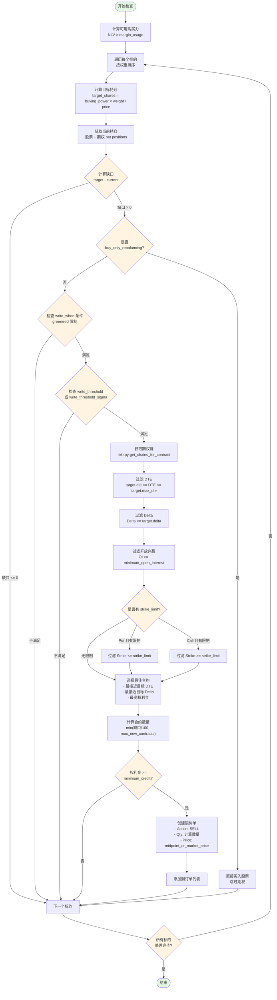
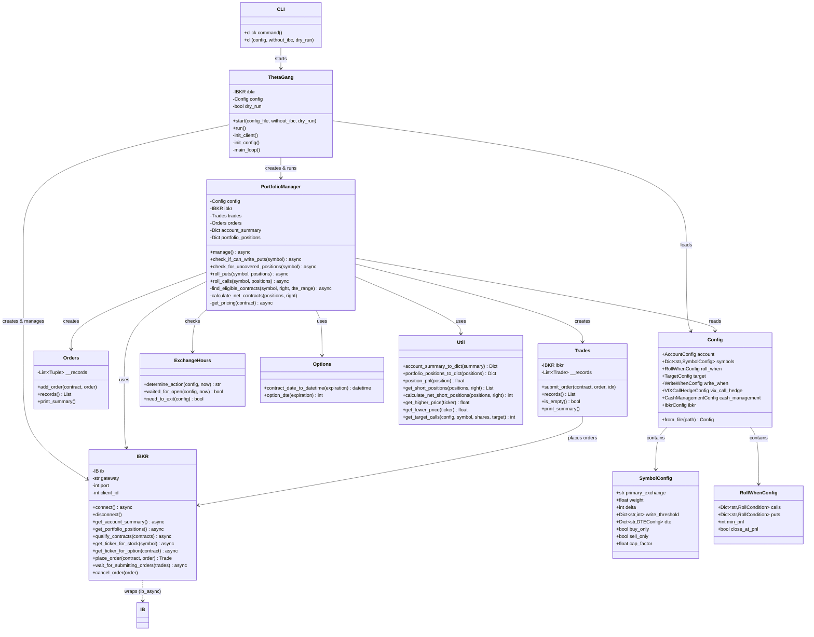
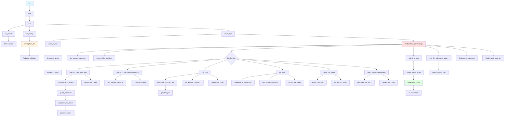
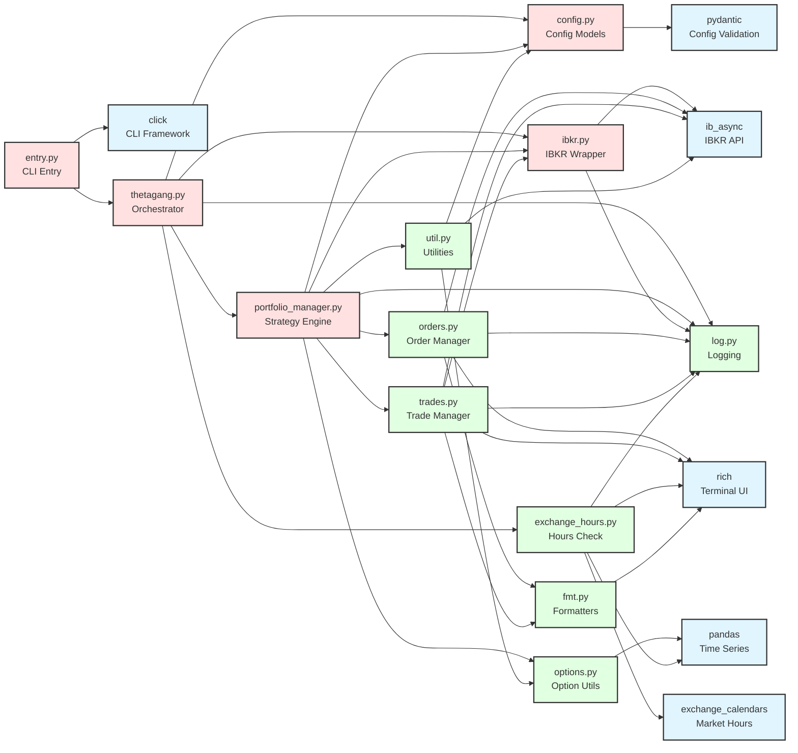

# ThetaGang 模块技术文档

> **文档版本**: v1.0
> **项目版本**: 1.16.2
> **生成日期**: 2025-11-18
> **文档状态**: 详细技术规格说明

---

## 第1章 模块概述

### 1.1 核心功能和设计目标

#### 模块定位
ThetaGang 是一个基于 Interactive Brokers (IBKR) API 的**自动化期权交易机器人**，专门用于执行"轮动策略"（The Wheel Strategy）以及相关的期权卖方策略。该项目通过系统化的方式收取期权权利金，实现资产的稳定增值。

#### 核心功能

**1. 期权卖方策略自动化**
- **卖出现金担保看跌期权 (Cash-Secured Puts, CSP)**：当账户有足够购买力时，自动卖出看跌期权以获取权利金
- **卖出备兑看涨期权 (Covered Calls, CC)**：当持有股票仓位时，自动卖出看涨期权以增强收益
- **期权滚动 (Rolling)**：在期权到期前或达到盈亏目标时，自动将合约滚动到下一个到期日或更优价格
- **自动行权管理**：处理 ITM (In-The-Money) 期权的行权场景

**2. 投资组合管理**
- **多资产配置**：支持按权重配置多个股票/ETF的目标持仓比例
- **动态再平衡**：
  - Buy-only rebalancing：仅买入方式维持目标配置
  - Sell-only rebalancing：仅卖出方式减少超配仓位
  - 期权方式再平衡：通过卖出 Put/Call 调整仓位
- **VIX 看涨期权对冲**：可选的尾部风险对冲策略（基于 CBOE VXTH 指数方法）
- **现金管理**：自动将闲置现金投资于短期国债 ETF（如 SGOV）

**3. 风险控制机制**
- **保证金使用限制**：可配置保证金使用率上限（默认 50% NLV）
- **Delta 目标控制**：限制期权 Delta 值以控制方向性风险（默认 ≤0.3）
- **DTE (Days To Expiration) 管理**：
  - 目标 DTE：新开仓的到期天数范围（默认 ≥45天）
  - 最大 DTE：防止开仓过长期限的合约（可选，默认 ≤180天）
- **执行价限制 (Strike Limits)**：防止在不利价格开仓
- **最大新合约限制**：限制单次运行新开仓数量（默认 5% 购买力）

**4. 智能订单执行**
- **自适应算法订单**：使用 IBKR Adaptive 算法优化成交（Patient 优先级）
- **价格调整机制**：订单未成交时自动调整至中间价
- **最小权利金过滤**：避免开仓权利金过低的合约（默认 $0.05）
- **市场时段控制**：可配置仅在特定交易时段运行

#### 设计目标

**1. 稳定性优先**
- 降低投资组合波动率而非追求最大收益
- 通过收取权利金的方式获取持续性收入流
- 利用"隐含波动率 > 实际波动率"的统计优势

**2. 自动化与无人值守**
- 支持通过 cron 定时任务每日/每周/每月自动运行
- 完整的异常处理和重试机制
- Dry-run 模式支持模拟运行

**3. 高度可配置**
- 所有策略参数均可通过 TOML 配置文件调整
- 支持全局配置和单个标的配置的层级覆盖
- 支持多种策略组合（Wheel、PMCC、Calendar Spread 等）

**4. 风险透明化**
- 详细的日志输出和富文本表格展示
- 每次运行前展示账户状态、持仓详情、待执行操作
- Dry-run 模式允许验证策略而不实际下单

#### 适用场景

✅ **推荐使用场景**：
- 持有指数 ETF（如 SPY、QQQ、TLT）长期投资者
- 希望通过卖出期权增强收益的投资者
- 有足够资本（建议 ≥$30,000）承担行权风险
- 接受通过放弃部分上涨潜力来降低风险

⚠️ **不推荐场景**：
- 追求短期暴利
- 资金量不足以承担 100 股行权
- 交易低流动性股票或 ETF
- 牛市中希望捕获全部涨幅

#### 核心假设与风险

**基础假设**：
- 长期而言，隐含波动率（IV）高于实际波动率（RV）
- 市场最终会均值回归
- 投资者愿意持有配置标的的股票

**主要风险**：
- **裸卖 Put 的理论无限下行风险**：标的归零时损失为执行价 × 100
- **错过上涨机会**：Covered Call 限制了上行收益
- **趋势市场表现不佳**：单边上涨或下跌市场中该策略可能跑输买入持有
- **保证金风险**：市场剧烈波动可能导致保证金不足被强制平仓

---

### 1.2 模块职责与协作关系

#### 模块在系统中的职责

ThetaGang 作为一个独立的交易执行系统，其核心职责包括：

1. **策略执行层**：
   - 解析用户配置的交易策略参数
   - 根据市场数据和持仓状态做出交易决策
   - 生成并提交订单到 IBKR

2. **风险管理层**：
   - 监控账户保证金使用率
   - 控制单次开仓规模
   - 限制期权 Delta 暴露

3. **持仓管理层**：
   - 跟踪所有期权和股票持仓
   - 计算目标持仓与实际持仓的偏差
   - 执行再平衡操作

4. **订单管理层**：
   - 处理订单的提交、监控、调整
   - 管理期权滚动（组合订单）
   - 处理订单失败和重试

#### 上下游模块协作关系

```
┌─────────────────────────────────────────────────────────────┐
│                        用户交互层                             │
│  ┌──────────────┐  ┌──────────────┐  ┌──────────────┐      │
│  │ thetagang.toml│  │   CLI 参数   │  │  Cron 调度   │      │
│  └──────┬───────┘  └──────┬───────┘  └──────┬───────┘      │
└─────────┼──────────────────┼──────────────────┼─────────────┘
          │                  │                  │
          └──────────────────┼──────────────────┘
                             ▼
┌─────────────────────────────────────────────────────────────┐
│                      ThetaGang 核心                          │
│  ┌────────────────────────────────────────────────────┐    │
│  │  entry.py (CLI 入口)                               │    │
│  └────────────┬───────────────────────────────────────┘    │
│               ▼                                             │
│  ┌────────────────────────────────────────────────────┐    │
│  │  thetagang.py (启动流程)                           │    │
│  └────────────┬───────────────────────────────────────┘    │
│               ▼                                             │
│  ┌────────────────────────────────────────────────────┐    │
│  │  portfolio_manager.py (策略执行核心)               │    │
│  │  - manage() 主流程                                  │    │
│  │  - check_if_can_write_puts()                        │    │
│  │  - check_for_uncovered_positions()                  │    │
│  │  - roll_puts() / roll_calls()                       │    │
│  └────┬────────────────────────┬────────────────┬──────┘    │
│       │                        │                │           │
│  ┌────▼─────┐  ┌──────────────▼────┐  ┌────────▼──────┐   │
│  │ orders.py│  │    trades.py      │  │   util.py     │   │
│  │ (订单记录)│  │   (交易提交)       │  │  (工具函数)    │   │
│  └──────────┘  └───────────────────┘  └───────────────┘   │
└─────────┬───────────────────────────────────────┬───────────┘
          │                                       │
          ▼                                       ▼
┌─────────────────────────┐      ┌───────────────────────────┐
│   ibkr.py (IBKR封装)     │◄─────│ ib_async (第三方库)        │
│  - 账户数据获取          │      │  - IB Gateway 通信         │
│  - 市场数据获取          │      │  - Watchdog 监控           │
│  - 订单提交              │      │  - IBC 管理                │
└────────┬────────────────┘      └───────────────────────────┘
         │
         ▼
┌─────────────────────────────────────────────────────────────┐
│                  Interactive Brokers                         │
│  ┌──────────────┐  ┌──────────────┐  ┌──────────────┐      │
│  │  IB Gateway  │  │  TWS (Trader │  │  IBKR 服务器  │      │
│  │   (API)      │  │  Workstation)│  │  (后端)       │      │
│  └──────────────┘  └──────────────┘  └──────────────┘      │
└─────────────────────────────────────────────────────────────┘
```

#### 关键依赖关系

1. **ThetaGang → IBC/TWS**：
   - ThetaGang 通过 IBC (IB Controller) 自动启动和管理 TWS Gateway
   - IBC 负责自动登录、重连、错误恢复

2. **ThetaGang → ib_async**：
   - ib_async 提供 Python 异步 API 封装
   - 处理实时数据流和事件监听

3. **ThetaGang → Exchange Calendars**：
   - 判断市场开盘/闭市时间
   - 支持全球多个交易所

4. **配置驱动**：
   - 所有行为由 `thetagang.toml` 配置文件驱动
   - 支持配置热加载（需重启）

---

### 1.3 输入输出数据格式

#### 输入数据

**1. 配置文件 (`thetagang.toml`)**

```toml
[account]
number = "DU1234567"              # IBKR 账户号
margin_usage = 0.5                # 使用 50% 净资产作为购买力
cancel_orders = true              # 启动时取消未完成订单

[symbols.SPY]
weight = 0.4                      # SPY 占总配置的 40%
primary_exchange = ""             # 主交易所（ETF 通常不需要）

[symbols.SPY.puts]
delta = 0.3                       # 目标 Delta ≤ 0.3
strike_limit = 400.0              # 不卖执行价 > $400 的 Put

[target]
dte = 45                          # 目标到期天数 ≥ 45
delta = 0.3                       # 默认 Delta
maximum_new_contracts_percent = 0.05  # 单次最多开仓 5% 购买力

[roll_when]
dte = 15                          # DTE ≤ 15 时考虑滚动
pnl = 0.9                         # P&L ≥ 90% 时考虑滚动
min_pnl = 0.0                     # 滚动时最小 P&L 要求
```

**2. 运行时输入（IBKR API 实时数据）**

- **账户数据**：
  ```python
  AccountValue(
      account='DU1234567',
      tag='NetLiquidation',
      value='100000.00',
      currency='USD'
  )
  ```

- **持仓数据**：
  ```python
  PortfolioItem(
      contract=Stock('SPY', 'SMART', 'USD'),
      position=100.0,                 # 持有 100 股
      marketPrice=450.25,             # 当前市价
      averageCost=445.00,             # 平均成本
      unrealizedPNL=525.00           # 未实现盈亏
  )
  ```

- **期权链数据**：
  ```python
  OptionChain(
      exchange='SMART',
      underlyingConId=756733,
      tradingClass='SPY',
      multiplier='100',
      expirations=['20250117', '20250124', ...],
      strikes=[400.0, 405.0, 410.0, ...]
  )
  ```

**3. 命令行参数**

```bash
thetagang --config /path/to/thetagang.toml \
          --without-ibc \           # 不自动启动 IBC
          --dry-run                 # 模拟运行，不实际下单
```

#### 输出数据

**1. 控制台输出（Rich 格式化表格）**

```
╭─ Account summary ─────────────────────────────────╮
│ Net liquidation      │  $100,000.00              │
│ Excess liquidity     │   $85,000.00              │
│ Buying power         │   $50,000.00              │
╰───────────────────────────────────────────────────╯

╭─ Portfolio positions ─────────────────────────────╮
│ Symbol │ R │ Qty │ MktPrice │ Value │ P&L  │ DTE│
├────────┼───┼─────┼──────────┼───────┼──────┼────┤
│ SPY    │ S │ 100 │ $450.25  │ $45k  │ 1.2% │ -  │
│        │ P │ -2  │ $2.35    │ -$470 │ 65%  │ 23 │
╰───────────────────────────────────────────────────╯
```

**2. 订单输出（提交到 IBKR）**

- **限价单 (Limit Order)**：
  ```python
  LimitOrder(
      action='SELL',              # 卖出开仓
      totalQuantity=2,            # 2 张合约
      lmtPrice=2.35,             # 限价 $2.35
      orderType='LMT',
      tif='DAY',                 # 当日有效
      algoStrategy='Adaptive',
      algoParams=[
          TagValue('adaptivePriority', 'Patient')
      ]
  )
  ```

- **组合单 (Combo Order, 用于滚动)**：
  ```python
  ComboOrder(
      comboLegs=[
          ComboLeg(conId=12345, ratio=1, action='BUY'),   # 平旧仓
          ComboLeg(conId=67890, ratio=1, action='SELL')   # 开新仓
      ],
      orderType='LMT',
      lmtPrice=0.50,  # 净信用 $0.50
  )
  ```

**3. 日志文件 (`ib_async.log`)**

```
2025-11-18 09:00:01 INFO Connected to IB Gateway, serverVersion=178
2025-11-18 09:00:05 INFO SPY: Qualified contract Stock('SPY', 'SMART', 'USD')
2025-11-18 09:00:10 INFO SPY: Writing 2 puts with strike=440.0, delta=0.28, dte=47
2025-11-18 09:00:15 INFO SPY: Order filled
```

**4. Dry-run 模式输出（无实际提交）**

```
⚠ Dry run enabled, no trades will be executed.

╭─ Order Summary ───────────────────────────────────╮
│ Symbol │ Contract │ Action │ Price │ Qty         │
├────────┼──────────┼────────┼───────┼─────────────┤
│ SPY    │ P 440    │ SELL   │ $2.35 │ 2           │
│ QQQ    │ P 360    │ SELL   │ $3.10 │ 3           │
╰───────────────────────────────────────────────────╯
```

---

### 1.4 子模块与策略组件

#### 核心子模块列表

| 模块名 | 文件路径 | 职责 | 主要类/函数 |
|--------|----------|------|-------------|
| **CLI 入口** | `thetagang/entry.py` | 命令行参数解析和入口 | `cli()` |
| **启动流程** | `thetagang/thetagang.py` | 初始化 IBC、连接 IBKR | `start()` |
| **核心策略** | `thetagang/portfolio_manager.py` | 策略执行主流程 | `PortfolioManager` |
| **配置管理** | `thetagang/config.py` | Pydantic 配置模型 | `Config`, `SymbolConfig` |
| **IBKR 封装** | `thetagang/ibkr.py` | IBKR API 封装 | `IBKR` |
| **订单管理** | `thetagang/orders.py` | 订单记录 | `Orders` |
| **交易提交** | `thetagang/trades.py` | 交易提交和跟踪 | `Trades` |
| **工具函数** | `thetagang/util.py` | 通用计算函数 | `position_pnl()`, `get_target_calls()` |
| **期权工具** | `thetagang/options.py` | 期权 DTE 计算 | `option_dte()` |
| **市场时间** | `thetagang/exchange_hours.py` | 交易时段判断 | `need_to_exit()` |
| **日志** | `thetagang/log.py` | 日志配置 | （未在提供代码中详述） |
| **格式化** | `thetagang/fmt.py` | 输出格式化工具 | `dfmt()`, `pfmt()`, `ffmt()` |

#### 策略组件说明

**1. Wheel 策略组件**

- **Put 卖方 (CSP)**：`portfolio_manager.py:check_if_can_write_puts()`
  - 检查购买力是否足够
  - 选择符合 Delta/DTE 条件的合约
  - 生成卖出 Put 订单

- **Call 卖方 (CC)**：`portfolio_manager.py:check_for_uncovered_positions()`
  - 检查股票持仓是否有未覆盖的部分
  - 选择执行价高于持股成本的 Call
  - 生成卖出 Call 订单

- **滚动逻辑**：`portfolio_manager.py:roll_puts()` / `roll_calls()`
  - 判断是否满足滚动条件（DTE、P&L）
  - 寻找下一个到期日的合适合约
  - 生成组合订单（买入平仓旧合约 + 卖出开仓新合约）

**2. 再平衡组件**

- **Buy-only 再平衡**：`portfolio_manager.py:check_buy_only_positions()`
  - 适用场景：期权流动性不足或希望直接买入股票
  - 计算目标持仓与实际持仓差距
  - 生成股票买入订单

- **Sell-only 再平衡**：`portfolio_manager.py:check_sell_only_positions()`
  - 适用场景：减少过度配置的仓位
  - 仅卖出股票，不使用期权
  - 支持阈值配置（如仅当超配 >20% 时才卖出）

**3. VIX 对冲组件**

- **VIX Call 购买**：`portfolio_manager.py:do_vix_hedging()`
  - 根据 VIX 现值动态调整对冲仓位
  - 按 VXTH 方法配置（VIX <15: 0%, 15-30: 1% NLV, 30-50: 0.5% NLV）
  - 当 VIX >50 时自动平仓对冲

**4. 现金管理组件**

- **现金基金交易**：`portfolio_manager.py:do_cashman()`
  - 当现金余额高于阈值时买入短期国债 ETF
  - 当现金余额低于阈值时卖出现金基金
  - 使用 VWAP 算法减少市场冲击

#### 配置与策略适配场景

| 策略类型 | 配置关键点 | 适用标的 | 风险特征 |
|---------|-----------|---------|---------|
| **标准 Wheel** | `delta=0.3`, `dte=45` | SPY, QQQ, TLT | 中低风险，稳定收益 |
| **激进 Wheel** | `delta=0.4-0.5`, `dte=30` | 高波动 ETF | 更高权利金，更高行权概率 |
| **PMCC (穷人版备兑)** | `calculate_net_contracts=true` | 需手动买入 LEAPS | 杠杆策略，资本效率高 |
| **Buy-only 建仓** | `buy_only_rebalancing=true` | 低流动性股票 | 避免期权滑点 |
| **VIX 对冲 Wheel** | `vix_call_hedge.enabled=true` | 任何标的 + VIX | 降低尾部风险 |

---

### 1.5 版本信息与迭代历史

#### 当前版本
- **版本号**：v1.16.2 (源自 `pyproject.toml`)
- **Python 要求**：≥3.10, <3.14
- **主要贡献者**：Brenden Matthews (brenden@brndn.io)
- **许可证**：AGPL-3.0-only

#### 从 Git 历史推断的迭代重点

**最近提交**（从 README 和代码推断）：

```
05f7c63  Bump the deps group with 2 updates (#620)
         → 依赖更新，可能是 ib-async 或 pydantic

8edc8fb  test(ibkr): cover account snapshot readiness (#619)
         → 增强账户快照就绪性测试，提高启动可靠性

9ca9088  Update pytest requirement in the deps group (#618)
         → 测试框架更新

d7c79a1  fix: tolerate account update timeouts (#617)
         → 容忍账户更新超时，避免启动失败

ca727ef  fix: better portfolio data loading (#615)
         → 改进持仓数据加载逻辑，解决数据不完整问题
```

**功能演进趋势**（从配置文件和代码注释推断）：

1. **v1.0-1.5**：核心 Wheel 策略实现
2. **v1.6-1.10**：添加 VIX 对冲、现金管理
3. **v1.11-1.14**：引入 Buy-only/Sell-only 再平衡
4. **v1.15+**：增强 IBKR API 稳定性、支持更多期权策略

**待确认**：完整的版本发布日志需查看 GitHub Releases 页面

---

## 第2章 架构设计

### 2.1 项目文件结构

```
thetagang/
├── thetagang/                    # 核心代码包
│   ├── __init__.py               # 包初始化
│   ├── entry.py                  # CLI 入口 (59 行)
│   ├── main.py                   # 主函数导出 (46 行)
│   ├── thetagang.py              # 启动流程 (77 行)
│   ├── portfolio_manager.py      # 策略核心 (3469 行)
│   ├── config.py                 # 配置模型 (878 行)
│   ├── ibkr.py                   # IBKR 封装 (463 行)
│   ├── orders.py                 # 订单记录 (47 行)
│   ├── trades.py                 # 交易提交 (75 行)
│   ├── util.py                   # 工具函数 (235 行)
│   ├── options.py                # 期权工具 (14 行)
│   ├── exchange_hours.py         # 市场时间 (87 行)
│   ├── log.py                    # 日志配置
│   └── fmt.py                    # 格式化 (94 行)
├── tests/                        # 测试代码
│   ├── test_portfolio_manager.py
│   ├── test_ibkr.py
│   ├── test_config.py
│   ├── test_buy_only_relative_threshold.py
│   ├── test_sell_only_rebalancing.py
│   ├── test_write_calls_threshold.py
│   └── ...
├── data/                         # 示例数据
├── stubs/                        # 类型存根
├── tws/                          # TWS 相关文件
├── pyproject.toml                # Python 项目配置
├── uv.lock                       # 依赖锁定文件
├── thetagang.toml                # 策略配置示例
├── Dockerfile                    # Docker 镜像定义
├── README.md                     # 项目文档
└── LICENSE                       # AGPL-3.0 许可证

总计代码行数: ~5,365 行 (不含测试)
```

**目录作用说明**：

- **thetagang/**：主代码包，包含所有核心逻辑
- **tests/**：pytest 测试套件，覆盖核心功能
- **data/**：示例数据文件（未详述）
- **stubs/**：第三方库类型存根（为 Pyright 类型检查提供支持）
- **tws/**：TWS (Trader Workstation) 安装文件或配置

---

### 2.2 功能模块划分

#### 分层架构

```
┌─────────────────────────────────────────────────────────┐
│                    表示层 (Presentation)                 │
│  - CLI (entry.py): 命令行参数解析                        │
│  - 富文本输出 (Rich库): 表格、面板、进度条               │
└────────────────────────┬────────────────────────────────┘
                         │
┌────────────────────────▼────────────────────────────────┐
│                   业务逻辑层 (Business Logic)            │
│  - PortfolioManager: 策略执行主流程                     │
│  - 期权卖方策略: CSP + CC + Rolling                     │
│  - 再平衡策略: Buy-only / Sell-only                     │
│  - 对冲策略: VIX Call Hedging                           │
│  - 现金管理: Cash Fund Trading                          │
└────────────────────────┬────────────────────────────────┘
                         │
┌────────────────────────▼────────────────────────────────┐
│                   数据访问层 (Data Access)               │
│  - IBKR类: 封装 ib_async API 调用                       │
│  - 账户数据获取: accountSummary, portfolio              │
│  - 市场数据获取: reqMktData, reqHistoricalData         │
│  - 订单提交: placeOrder, cancelOrder                    │
└────────────────────────┬────────────────────────────────┘
                         │
┌────────────────────────▼────────────────────────────────┐
│                   外部服务层 (External Services)         │
│  - ib_async: IBKR API 客户端                            │
│  - IBC: TWS Gateway 控制器                              │
│  - Exchange Calendars: 市场时间查询                     │
└─────────────────────────────────────────────────────────┘
```

#### 模块职责划分

| 层次 | 模块 | 职责 | 关键类/函数 |
|------|------|------|-------------|
| **表示层** | entry.py | CLI 入口，参数解析 | `cli()` |
|  | fmt.py | 数据格式化输出 | `dfmt()`, `pfmt()` |
| **业务逻辑层** | portfolio_manager.py | 策略核心逻辑 | `PortfolioManager.manage()` |
|  | thetagang.py | 启动和连接管理 | `start()` |
|  | config.py | 配置模型和验证 | `Config`, Pydantic 模型 |
| **数据访问层** | ibkr.py | IBKR API 封装 | `IBKR` 类 |
|  | util.py | 数据计算和转换 | `position_pnl()`, `get_target_calls()` |
|  | options.py | 期权日期计算 | `option_dte()` |
| **工具层** | orders.py | 订单记录容器 | `Orders` |
|  | trades.py | 交易提交和跟踪 | `Trades` |
|  | exchange_hours.py | 市场时间判断 | `need_to_exit()` |

---

### 2.3 主流程控制路径

#### 程序入口到策略执行

```python
# 1. CLI 入口
entry.py:cli()
    ↓
# 2. 加载配置和启动
thetagang.py:start()
    ├─ 加载 thetagang.toml
    ├─ 验证配置 (Config(**normalize_config(config)))
    ├─ 检查市场时间 (need_to_exit())
    ├─ 启动 IBC (如果 --without-ibc 未设置)
    │   └─ IBC → TWS Gateway → IBKR API 连接
    └─ 连接成功后回调 onConnected()
          ↓
# 3. 策略执行主流程
portfolio_manager.py:PortfolioManager.manage()
    ├─ initialize_account()           # 设置市场数据类型、取消旧订单
    ├─ summarize_account()            # 获取账户摘要和持仓
    │   ├─ get_portfolio_positions()  # 获取持仓 (带重试)
    │   └─ 输出账户和持仓表格
    │
    ├─ check_if_can_write_puts()      # 检查是否可以卖出 Put
    ├─ check_for_uncovered_positions() # 检查未覆盖股票仓位
    ├─ write_puts()                    # 提交 Put 订单
    ├─ write_calls()                   # 提交 Call 订单
    │
    ├─ check_buy_only_positions()     # Buy-only 再平衡
    ├─ execute_buy_orders()           # 执行股票买入
    ├─ check_sell_only_positions()    # Sell-only 再平衡
    ├─ execute_sell_orders()          # 执行股票卖出
    │
    ├─ check_puts() / check_calls()   # 检查可滚动/可平仓的期权
    ├─ roll_puts() / roll_calls()     # 滚动期权
    ├─ close_puts() / close_calls()   # 平仓期权
    │
    ├─ do_vix_hedging()               # VIX 对冲
    ├─ do_cashman()                   # 现金管理
    │
    └─ 提交订单或输出 Dry-run 摘要
        ├─ submit_orders()            # 提交所有订单
        ├─ wait_for_submitting_orders() # 等待订单状态更新
        ├─ adjust_prices()            # 调整未成交订单价格
        └─ completion_future.set_result(True) # 标记完成
```

#### 关键决策点

1. **市场时间检查**（thetagang.py:29）：
   - 如果市场关闭且配置为 `action_when_closed="exit"`，直接退出
   - 如果配置为 `"wait"`，等待市场开盘（最多等待 `max_wait_until_open` 秒）

2. **账户数据加载**（portfolio_manager.py:350-462）：
   - 最多重试 3 次获取账户快照
   - 验证持仓数据完整性（对比 `portfolio()` 和 `positions()`）
   - 如果数据不一致，等待 1 秒后重试

3. **期权滚动判断**（portfolio_manager.py:143-329）：
   - 检查 DTE、P&L、ITM 状态
   - 如果配置了 `always_when_itm`，ITM 期权立即滚动
   - 如果有 excess contracts 且 `has_excess=false`，跳过滚动

4. **订单价格调整**（portfolio_manager.py 的 `adjust_prices()`）：
   - 如果订单未成交且 `adjust_price_after_delay=true`
   - 等待随机延迟（30-60秒）
   - 重新获取市场价格并更新订单

---

### 2.4 数据流动方式

#### 数据流向图

```
IBKR API
  │
  ├─ AccountValue ────┐
  ├─ PortfolioItem ───┤
  ├─ Position ────────┤
  └─ Ticker ──────────┤
                     ▼
                  IBKR.py
                   (封装)
                     │
                     ├─ account_summary_to_dict()
                     ├─ portfolio_positions_to_dict()
                     └─ get_ticker_for_contract()
                     │
                     ▼
            PortfolioManager
         (业务逻辑计算)
                     │
                     ├─ 计算目标持仓
                     ├─ 选择期权合约
                     ├─ 计算滚动条件
                     └─ 生成订单
                     │
                     ▼
            Orders / Trades
           (订单记录和提交)
                     │
                     ▼
                 IBKR API
              (placeOrder)
```

#### 引用传递 vs 值传递

- **引用传递**：
  - `PortfolioItem`、`Contract`、`Ticker` 等 ib_async 对象
  - 这些对象在整个流程中通过引用传递，避免复制开销

- **值传递**：
  - 简单类型：`float`, `int`, `str`（如 Delta、DTE、执行价）
  - 不可变对象：配置对象（Pydantic 模型）

- **字典封装**：
  - `account_summary_to_dict()`: 将 `List[AccountValue]` 转为 `Dict[str, AccountValue]`
  - `portfolio_positions_to_dict()`: 将 `List[PortfolioItem]` 按 symbol 分组

#### 中间结果缓存

- **合约缓存** (`qualified_contracts: Dict[int, Contract]`)：
  - 已验证的合约通过 `conId` 缓存
  - 避免重复调用 `qualifyContractsAsync()`

- **市场数据缓存** (implicit in ib_async)：
  - ib_async 内部维护 Ticker 缓存
  - `reqMktData()` 返回的 Ticker 对象会持续更新

---

### 2.5 设计模式应用

#### 1. **策略模式 (Strategy Pattern)**

**应用点**：期权卖方策略的选择

```python
class PortfolioManager:
    async def check_if_can_write_puts(self, ...):
        # CSP 策略
        pass
    
    async def check_for_uncovered_positions(self, ...):
        # Covered Call 策略
        pass
    
    async def check_buy_only_positions(self, ...):
        # Buy-only 再平衡策略
        pass
```

**优点**：不同策略组件可独立实现和测试，通过配置选择启用哪些策略

#### 2. **工厂模式 (Factory Pattern)**

**应用点**：配置对象创建

```python
# config.py
def normalize_config(config: Dict) -> Dict:
    # 预处理配置，处理 parts → weight 转换
    ...
    return config

config = Config(**normalize_config(raw_config))
```

**优点**：配置创建逻辑集中，支持向后兼容（处理废弃字段）

#### 3. **门面模式 (Facade Pattern)**

**应用点**：IBKR 类对 ib_async 的封装

```python
class IBKR:
    async def get_ticker_for_stock(self, symbol, ...):
        # 封装复杂的 ib_async API 调用
        stock = Stock(symbol, exchange, ...)
        await self.ib.qualifyContractsAsync(stock)
        ticker = self.ib.reqMktData(stock, ...)
        await self.__wait_for_market_price__(ticker)
        return ticker
```

**优点**：隐藏 ib_async 的复杂性，提供简化接口

#### 4. **观察者模式 (Observer Pattern)**

**应用点**：订单状态事件监听

```python
class IBKR:
    def __init__(self, ib, ...):
        self.ib.orderStatusEvent += self.orderStatusEvent
    
    def orderStatusEvent(self, trade: Trade):
        if "Filled" in trade.orderStatus.status:
            log.info(f"{trade.contract.symbol}: Order filled")
```

**优点**：解耦订单提交和状态处理逻辑

#### 5. **模板方法模式 (Template Method)**

**应用点**：期权滚动的通用流程

```python
async def roll_position(position, right):
    # 1. 检查是否可以滚动
    if not await can_be_rolled(position):
        return
    
    # 2. 寻找目标合约
    target = await find_target_contract(position, right)
    
    # 3. 生成组合订单
    combo_order = create_combo_order(position, target)
    
    # 4. 提交订单
    submit_order(combo_order)
```

**优点**：Put 和 Call 滚动逻辑复用相同流程框架

#### 6. **数据传输对象 (DTO)**

**应用点**：Pydantic 配置模型

```python
class SymbolConfig(BaseModel):
    weight: float
    delta: Optional[float]
    dte: Optional[int]
    calls: Optional[CallsConfig]
    puts: Optional[PutsConfig]
```

**优点**：自动验证、类型提示、序列化支持

---

### 2.6 可扩展性设计

#### 插件化配置

- **分层配置覆盖**：
  ```
  全局默认 → constants → target → symbol → symbol.calls/puts
  ```
  支持精细化配置个别标的或期权类型

- **策略组合**：
  可同时启用多个策略（Wheel + VIX 对冲 + 现金管理）

#### 模块解耦

- **IBKR 层抽象**：
  - 理论上可替换为其他券商 API（需实现相同接口）
  - 当前实现与 ib_async 紧耦合

- **配置驱动**：
  - 所有策略参数外置到 TOML 文件
  - 无需修改代码即可调整行为

#### 依赖注入

```python
class PortfolioManager:
    def __init__(self, config: Config, ib: IB, ...):
        self.config = config
        self.ibkr = IBKR(ib, ...)  # 注入 IB 实例
```

**优点**：便于单元测试（可注入 Mock 对象）

---
## 第3章 核心流程图

### 3.1 主流程 Mermaid 图

```mermaid
flowchart TB
    Start([用户执行 thetagang]) --> LoadConfig[加载 thetagang.toml<br/>thetagang/thetagang.py:18]
    LoadConfig --> ValidateConfig[验证配置<br/>config.py:Config]
    ValidateConfig --> CheckHours{检查市场时间<br/>exchange_hours.py:need_to_exit}
    
    CheckHours -->|市场关闭且 exit| End([退出程序])
    CheckHours -->|市场关闭且 wait| WaitOpen[等待市场开盘<br/>最多等待 max_wait_until_open]
    CheckHours -->|市场开盘或 continue| StartIBC
    WaitOpen -->|超时| End
    WaitOpen -->|开盘| StartIBC
    
    StartIBC[启动 IBC<br/>thetagang.py:54] --> ConnectIBKR[连接 IBKR API<br/>ib_async.IB.connect]
    ConnectIBKR --> OnConnected[回调 onConnected<br/>thetagang.py:32]
    OnConnected --> InitAccount[初始化账户<br/>portfolio_manager.py:464]
    
    InitAccount --> CancelOrders[取消旧订单<br/>如果 cancel_orders=true]
    CancelOrders --> GetAccount[获取账户摘要<br/>portfolio_manager.py:488]
    GetAccount --> GetPositions[获取持仓数据<br/>portfolio_manager.py:350<br/>带重试机制]
    
    GetPositions --> DisplaySummary[显示账户和持仓表格<br/>Rich 格式化输出]
    
    DisplaySummary --> CheckPuts[检查是否可卖 Put<br/>portfolio_manager.py:check_if_can_write_puts]
    CheckPuts --> CheckCalls[检查未覆盖股票<br/>portfolio_manager.py:check_for_uncovered_positions]
    
    CheckCalls --> WritePuts[提交 Put 订单<br/>portfolio_manager.py:write_puts]
    WritePuts --> WriteCalls[提交 Call 订单<br/>portfolio_manager.py:write_calls]
    
    WriteCalls --> BuyOnly[Buy-only 再平衡<br/>portfolio_manager.py:check_buy_only_positions]
    BuyOnly --> SellOnly[Sell-only 再平衡<br/>portfolio_manager.py:check_sell_only_positions]
    
    SellOnly --> RefreshPos[刷新持仓数据]
    RefreshPos --> CheckRollPuts[检查可滚动 Put<br/>portfolio_manager.py:check_puts]
    CheckRollPuts --> CheckRollCalls[检查可滚动 Call<br/>portfolio_manager.py:check_calls]
    
    CheckRollCalls --> RollPuts[滚动 Put 期权<br/>portfolio_manager.py:roll_puts]
    RollPuts --> RollCalls[滚动 Call 期权<br/>portfolio_manager.py:roll_calls]
    
    RollCalls --> ClosePuts[平仓到期 Put<br/>portfolio_manager.py:close_puts]
    ClosePuts --> CloseCalls[平仓到期 Call<br/>portfolio_manager.py:close_calls]
    
    CloseCalls --> VIXHedge[VIX 对冲<br/>portfolio_manager.py:do_vix_hedging]
    VIXHedge --> CashMgmt[现金管理<br/>portfolio_manager.py:do_cashman]
    
    CashMgmt --> IsDryRun{是否 Dry-run}
    IsDryRun -->|是| PrintOrders[输出订单摘要<br/>不实际提交]
    IsDryRun -->|否| SubmitOrders[提交所有订单<br/>portfolio_manager.py:submit_orders]
    
    SubmitOrders --> WaitSubmit[等待订单提交<br/>ibkr.py:wait_for_submitting_orders]
    WaitSubmit --> AdjustPrices[调整未成交订单价格<br/>portfolio_manager.py:adjust_prices]
    
    AdjustPrices --> PrintOrders
    PrintOrders --> Complete[设置完成标志<br/>completion_future.set_result]
    Complete --> End
    
    style Start fill:#e1f5e1
    style End fill:#ffe1e1
    style IsDryRun fill:#fff4e1
    style CheckHours fill:#fff4e1
```



---

### 3.2 期权滚动流程图



---

### 3.3 写入新合约流程图



---

## 第4章 关键算法详解

### 4.1 期权合约选择算法

#### 算法名称
**最佳期权合约筛选算法 (Best Option Contract Selection)**

#### 所在位置
`portfolio_manager.py:find_eligible_contracts()` (推断，实际代码中内联)

#### 设计原理

该算法用于从期权链中筛选出最符合策略要求的合约。核心思想是通过多级过滤 + 评分排序的方式找到最优合约。

**筛选条件**（按优先级）：
1. **DTE 范围**：`target.dte <= contract.DTE <= target.max_dte`
2. **Delta 限制**：`contract.delta <= target.delta`
3. **开放兴趣**：`contract.openInterest >= minimum_open_interest`
4. **执行价限制**：
   - Put: `strike <= strike_limit`（如果配置）
   - Call: `strike >= strike_limit`（如果配置）
5. **最小权利金**：`premium >= minimum_credit`

**评分函数**（用于排序）：
```python
def score_contract(contract, target_dte, target_delta):
    dte_score = abs(contract.dte - target_dte) / target_dte
    delta_score = abs(contract.delta - target_delta) / target_delta
    return dte_score + delta_score  # 越小越好
```

#### 时间复杂度

- **最坏情况**：O(n × log n)
  - n = 期权链中的合约数量
  - 遍历所有合约：O(n)
  - 排序：O(n log n)
  
- **平均情况**：O(n)
  - 大部分合约会在过滤阶段被淘汰
  - 实际参与排序的合约数量较少

#### 空间复杂度

- O(n)：需要存储筛选后的合约列表

#### 优缺点评价

**优点**：
- 多级过滤减少计算量
- 明确的优先级保证结果可预测
- 支持灵活的配置覆盖

**缺点**：
- 当市场波动剧烈时，可能找不到符合所有条件的合约
- Delta 和 DTE 的权重固定，无法动态调整

#### 核心代码解释

```python
# 伪代码示例（基于实际代码推断）
async def find_best_contract(
    symbol: str,
    right: str,  # 'P' 或 'C'
    target_dte: int,
    target_delta: float,
    strike_limit: Optional[float]
):
    # 1. 获取期权链
    chains = await ibkr.get_chains_for_contract(symbol)
    
    # 2. 展开所有合约
    all_contracts = []
    for chain in chains:
        for expiration in chain.expirations:
            for strike in chain.strikes:
                contract = Option(
                    symbol, expiration, strike, right, chain.exchange
                )
                all_contracts.append(contract)
    
    # 3. 过滤 DTE
    valid_dte = [
        c for c in all_contracts
        if target_dte <= option_dte(c.lastTradeDateOrContractMonth) <= max_dte
    ]
    
    # 4. 获取 Ticker 数据（包含 Delta 和价格）
    tickers = await ibkr.get_tickers_for_contracts(
        symbol, valid_dte,
        required_fields=[TickerField.GREEKS, TickerField.MARKET_PRICE]
    )
    
    # 5. 过滤 Delta 和开放兴趣
    eligible = []
    for ticker in tickers:
        if ticker.modelGreeks.delta > target_delta:
            continue
        if ticker.openInterest < minimum_open_interest:
            continue
        if strike_limit:
            if right == 'P' and ticker.contract.strike > strike_limit:
                continue
            if right == 'C' and ticker.contract.strike < strike_limit:
                continue
        
        price = midpoint_or_market_price(ticker)
        if price < minimum_credit:
            continue
        
        eligible.append((ticker, price))
    
    # 6. 按 DTE 和 Delta 距离排序
    eligible.sort(key=lambda x: (
        abs(option_dte(x[0].contract.lastTradeDateOrContractMonth) - target_dte),
        abs(x[0].modelGreeks.delta - target_delta)
    ))
    
    # 7. 返回最佳合约
    if eligible:
        return eligible[0]  # (ticker, price)
    else:
        raise NoValidContractsError(f"No valid contracts for {symbol}")
```

**逐段解释**：

1. **获取期权链**（步骤1-2）：
   - 从 IBKR API 获取所有可用的到期日和执行价
   - 构造 Option 合约对象

2. **DTE 预过滤**（步骤3）：
   - 快速过滤掉不在目标 DTE 范围内的合约
   - 减少后续需要获取市场数据的合约数量

3. **批量获取市场数据**（步骤4）：
   - 异步并发获取所有候选合约的 Ticker 数据
   - 包括 Delta（从 modelGreeks）、价格、开放兴趣

4. **多条件过滤**（步骤5）：
   - Delta 过滤：确保风险暴露可控
   - 开放兴趣过滤：确保流动性
   - 执行价过滤：避免不利价位开仓
   - 最小权利金过滤：避免手续费侵蚀收益

5. **智能排序**（步骤6）：
   - 首要：DTE 接近目标值
   - 次要：Delta 接近目标值
   - 这样可以在流动性和风险之间取得平衡

6. **返回结果**（步骤7）：
   - 返回排序后的第一个合约
   - 如果没有符合条件的合约，抛出异常

#### 边界场景

1. **无可用合约**：
   - 触发条件：市场波动过大，所有合约 Delta 都超过限制
   - 处理方式：抛出 `NoValidContractsError`，跳过该标的

2. **期权链为空**：
   - 触发条件：新上市股票或 IBKR API 错误
   - 处理方式：捕获异常并记录警告

3. **价格数据缺失**：
   - 触发条件：流动性极低的合约
   - 处理方式：`midpoint_or_market_price()` 降级到 model price

---

### 4.2 仓位再平衡算法

#### 算法名称
**目标权重再平衡算法 (Target Weight Rebalancing)**

#### 所在位置
`portfolio_manager.py:check_if_can_write_puts()`, `check_buy_only_positions()`

#### 设计原理

基于"目标权重"的投资组合再平衡算法。核心思想是计算每个标的的目标持仓，然后通过卖出期权（或直接买入股票）来逐步接近目标。

**计算公式**：

```python
# 1. 计算购买力
buying_power = NLV × margin_usage

# 2. 计算标的目标市值
target_value = buying_power × symbol.weight

# 3. 计算目标持仓股数
target_shares = target_value / current_price

# 4. 计算当前持仓（包括期权净头寸）
current_shares = stock_position + net_option_positions × 100

# 5. 计算缺口
gap = target_shares - current_shares

# 6. 计算需要开仓的期权合约数
if gap > 0:
    contracts_needed = min(
        gap // 100,  # 1 合约 = 100 股
        max_new_contracts  # 单次开仓限制
    )
```

**净头寸计算**（当 `calculate_net_contracts=true`）：

```python
def calculate_net_short_positions(positions, right):
    shorts = sorted(positions, key=lambda p: (p.dte, p.strike))
    longs = sorted(positions, key=lambda p: (p.dte, p.strike))
    
    for short in shorts:
        for long in longs:
            if long.dte >= short.dte:  # 长腿到期日更远
                if (right == 'P' and long.strike >= short.strike) or \
                   (right == 'C' and long.strike <= short.strike):
                    # 抵消头寸
                    offset = min(abs(short.position), long.position)
                    short.position += offset
                    long.position -= offset
    
    return sum(abs(s.position) for s in shorts)
```

#### 时间复杂度

- **标准模式**（不计算净头寸）：O(n)
  - n = 配置的标的数量
  - 每个标的独立计算，线性时间

- **净头寸模式**（`calculate_net_contracts=true`）：O(n × m²)
  - m = 每个标的的期权持仓数量
  - 需要对 shorts 和 longs 进行嵌套匹配

#### 空间复杂度

- O(n)：存储每个标的的持仓信息

#### 优缺点评价

**优点**：
- 自动化维持目标配置，无需手动干预
- 通过 `max_new_contracts_percent` 限制单次开仓规模，避免过度集中
- 支持净头寸计算，适配 PMCC、Calendar Spread 等策略

**缺点**：
- 市场剧烈波动时，目标持仓会频繁变化，可能导致过度交易
- 不考虑交易成本和滑点对再平衡效果的影响
- 依赖当前市价，对价格跳空敏感

#### 边界场景

1. **购买力不足**：
   - 触发条件：NLV 下降或 margin_usage 设置过低
   - 处理方式：按权重比例缩减所有标的的目标持仓

2. **单个标的权重过大**：
   - 触发条件：某个标的权重 >50% 但价格很高
   - 处理方式：可能无法开仓足够的合约，导致实际配置偏离目标

3. **净头寸计算失败**：
   - 触发条件：Long 和 Short 期权无法正确匹配
   - 处理方式：降级到简单的 Short 头寸计数

---

### 4.3 滚动决策算法

#### 算法名称
**期权滚动决策树 (Option Rolling Decision Tree)**

#### 所在位置
`portfolio_manager.py:put_can_be_rolled()`, `call_can_be_rolled()`

#### 设计原理

基于多条件决策树的期权滚动判断算法。算法按优先级依次检查多个条件，决定是否滚动期权。

**决策树结构**：

```
是否滚动?
├─ 条件1: always_when_itm=true 且 ITM
│  └─ 是 → 立即滚动
├─ 条件2: itm=false 且 ITM
│  └─ 是 → 不滚动
├─ 条件3: has_excess=false 且存在 excess contracts
│  └─ 是 → 不滚动
├─ 条件4: DTE <= roll_when.dte 且 P&L >= min_pnl
│  └─ 是 → 滚动
├─ 条件5: P&L >= roll_when.pnl 且 DTE <= max_dte
│  └─ 是 → 滚动
└─ 否 → 不滚动
```

**P&L 计算**：

```python
def position_pnl(position: PortfolioItem) -> float:
    denominator = position.averageCost * position.position
    if denominator == 0:
        return 0.0
    return position.unrealizedPNL / abs(denominator)
```

#### 时间复杂度

- O(1)：每个期权的决策只涉及常数次条件判断

#### 空间复杂度

- O(1)：仅需存储临时变量

#### 优缺点评价

**优点**：
- 决策逻辑清晰，易于理解和调试
- 支持灵活的配置组合
- `always_when_itm` 避免行权风险

**缺点**：
- 不考虑隐含波动率变化
- 固定的 DTE 和 P&L 阈值可能不适应所有市场环境
- 无法处理复杂的多腿策略（如 Iron Condor）

#### 边界场景

1. **深度 ITM 且 P&L 为负**：
   - 触发条件：股票大幅上涨，Covered Call 深度 ITM
   - 处理方式：如果 `always_when_itm=true`，仍会滚动（可能产生净借记）

2. **DTE=0 且市场关闭**：
   - 触发条件：到期日当天市场未开盘
   - 处理方式：期权会被自动行权，策略无法干预

3. **无可用滚动目标**：
   - 触发条件：下一个到期日的所有合约都不满足条件
   - 处理方式：如果配置了 `close_if_unable_to_roll=true`，直接平仓

---

## 第5章 数据结构分析

### 5.1 Pydantic 配置模型

#### Config 类（主配置）

**位置**：`config.py:Config`

**字段定义**：

```python
class Config(BaseModel):
    account: AccountConfig              # 账户配置
    option_chains: OptionChainsConfig   # 期权链加载配置
    roll_when: RollWhenConfig           # 滚动条件
    target: TargetConfig                # 目标参数
    exchange_hours: ExchangeHoursConfig # 市场时间
    orders: OrdersConfig                # 订单配置
    ib_async: IBAsyncConfig             # ib_async 配置
    ibc: IBCConfig                      # IBC 配置
    watchdog: WatchdogConfig            # Watchdog 配置
    cash_management: CashManagementConfig  # 现金管理
    vix_call_hedge: VIXCallHedgeConfig     # VIX 对冲
    write_when: WriteWhenConfig            # 写入条件
    symbols: Dict[str, SymbolConfig]       # 标的配置（核心）
    constants: ConstantsConfig             # 常量配置
```

**用途**：
- 作为全局配置的容器
- 提供配置验证（Pydantic 自动验证）
- 提供配置查询方法（如 `get_target_delta()`, `trading_is_allowed()`）

**生命周期**：
- 创建：程序启动时，从 `thetagang.toml` 加载
- 修改：运行期间不可修改（不可变对象）
- 销毁：程序退出时自动释放

**示例**：

```python
config = Config(**normalize_config(toml.load("thetagang.toml")))

# 查询配置
delta = config.get_target_delta("SPY", "P")  # 0.3
dte = config.get_target_dte("QQQ")           # 60
can_trade = config.trading_is_allowed("SPY") # True
```

---

#### SymbolConfig 类（标的配置）

**位置**：`config.py:SymbolConfig`

**字段定义**：

```python
class SymbolConfig(BaseModel):
    # 基础配置
    weight: float                        # 目标权重 (0.0-1.0)
    primary_exchange: str = ""           # 主交易所
    
    # 策略参数覆盖
    delta: Optional[float] = None        # Delta 目标（覆盖全局）
    dte: Optional[int] = None            # DTE 目标（覆盖全局）
    max_dte: Optional[int] = None        # 最大 DTE
    
    # Write threshold
    write_threshold: Optional[float] = None
    write_threshold_sigma: Optional[float] = None
    
    # 期权特定配置
    calls: Optional[CallsConfig] = None  # Call 参数
    puts: Optional[PutsConfig] = None    # Put 参数
    
    # 再平衡配置
    buy_only_rebalancing: Optional[bool] = None
    buy_only_min_threshold_shares: Optional[int] = None
    buy_only_min_threshold_amount: Optional[float] = None
    buy_only_min_threshold_percent: Optional[float] = None
    buy_only_min_threshold_percent_relative: Optional[float] = None
    
    sell_only_rebalancing: Optional[bool] = None
    sell_only_min_threshold_shares: Optional[int] = None
    sell_only_min_threshold_amount: Optional[float] = None
    sell_only_min_threshold_percent: Optional[float] = None
    sell_only_min_threshold_percent_relative: Optional[float] = None
    
    # Call writing thresholds
    write_calls_only_min_threshold_percent: Optional[float] = None
    write_calls_only_min_threshold_percent_relative: Optional[float] = None
    
    # 其他
    adjust_price_after_delay: bool = False
    close_if_unable_to_roll: Optional[bool] = None
    no_trading: Optional[bool] = None
```

**用途**：
- 为每个交易标的提供个性化配置
- 支持全局配置的覆盖（层级配置）
- 启用特定策略（如 buy-only、sell-only）

**默认值说明**：
- 大部分字段默认为 `None`，表示使用全局配置
- `weight` 必填，且所有标的的 weight 之和必须为 1.0

---

### 5.2 IBKR 数据结构

#### PortfolioItem（持仓项）

**来源**：`ib_async.objects.PortfolioItem`

**字段说明**：

```python
@dataclass
class PortfolioItem:
    contract: Contract          # 合约对象（Stock 或 Option）
    position: float             # 持仓数量（正数=多头，负数=空头）
    marketPrice: float          # 当前市价
    marketValue: float          # 市值 = position × marketPrice
    averageCost: float          # 平均成本
    unrealizedPNL: float        # 未实现盈亏
    realizedPNL: float          # 已实现盈亏
    account: str                # 账户号
```

**用途**：
- 表示账户中的单个持仓
- 计算 P&L 和仓位缺口

**示例**：

```python
# 股票持仓
PortfolioItem(
    contract=Stock('SPY', 'SMART', 'USD'),
    position=100.0,
    marketPrice=450.25,
    averageCost=445.00,
    unrealizedPNL=525.00,
    ...
)

# 期权持仓（空头）
PortfolioItem(
    contract=Option('SPY', '20250117', 440.0, 'P', 'SMART'),
    position=-2.0,
    marketPrice=2.35,
    averageCost=-2.50,
    unrealizedPNL=30.00,  # (2.50 - 2.35) × 2 × 100
    ...
)
```

---

#### Contract（合约）

**来源**：`ib_async.contract.Contract`

**子类**：
- `Stock`: 股票
- `Option`: 期权
- `Index`: 指数（如 VIX）

**字段说明**：

```python
# Stock
@dataclass
class Stock(Contract):
    symbol: str
    exchange: str
    currency: str
    primaryExchange: str

# Option
@dataclass
class Option(Contract):
    symbol: str                      # 标的代码
    lastTradeDateOrContractMonth: str  # 到期日 (YYYYMMDD)
    strike: float                    # 执行价
    right: str                       # 'P' 或 'C'
    exchange: str                    # 交易所
    multiplier: str = "100"          # 合约乘数
    conId: int = 0                   # 合约 ID（自动填充）
```

**用途**：
- 唯一标识一个金融工具
- 用于订单提交和市场数据请求

---

#### Ticker（市场数据）

**来源**：`ib_async.ticker.Ticker`

**字段说明**：

```python
@dataclass
class Ticker:
    contract: Contract
    time: datetime
    
    # 价格数据
    bid: float
    ask: float
    last: float
    close: float
    
    # 期权数据
    modelGreeks: OptionComputation  # Delta, Gamma, Theta, Vega
    callOpenInterest: float
    putOpenInterest: float
    
    # 方法
    def marketPrice() -> float:
        # 返回 last 或 close（降级）
    
    def midpoint() -> float:
        # 返回 (bid + ask) / 2
```

**用途**：
- 获取实时市场数据
- 计算期权 Delta 和价格

**生命周期**：
- 创建：调用 `ib.reqMktData(contract)` 时
- 更新：市场数据变化时自动更新（事件驱动）
- 销毁：调用 `ib.cancelMktData(contract)` 时

---

### 5.3 订单和交易数据结构

#### LimitOrder（限价单）

**来源**：`ib_async.order.LimitOrder`

**字段说明**：

```python
@dataclass
class LimitOrder(Order):
    action: str                 # 'BUY' 或 'SELL'
    totalQuantity: float        # 数量
    lmtPrice: float             # 限价
    orderType: str = 'LMT'      # 订单类型
    tif: str = 'DAY'            # Time In Force
    
    # 算法订单参数
    algoStrategy: str = ''      # 如 'Adaptive', 'VWAP'
    algoParams: List[TagValue] = []  # 算法参数
    
    # 组合订单（滚动时使用）
    comboLegs: List[ComboLeg] = []
```

**用途**：
- 定义订单的执行参数
- 提交给 IBKR API

**示例**：

```python
# 卖出 2 张 SPY Put
order = LimitOrder(
    action='SELL',
    totalQuantity=2,
    lmtPrice=2.35,
    tif='DAY',
    algoStrategy='Adaptive',
    algoParams=[TagValue('adaptivePriority', 'Patient')]
)

# 滚动订单（组合单）
combo_order = LimitOrder(
    action='SELL',  # 整体净信用
    totalQuantity=1,
    lmtPrice=0.50,  # 净信用 $0.50
    comboLegs=[
        ComboLeg(conId=12345, ratio=1, action='BUY'),   # 平旧仓
        ComboLeg(conId=67890, ratio=1, action='SELL')   # 开新仓
    ]
)
```

---

#### Trade（交易记录）

**来源**：`ib_async.objects.Trade`

**字段说明**：

```python
@dataclass
class Trade:
    contract: Contract
    order: Order
    orderStatus: OrderStatus
    fills: List[Fill]
    log: List[TradeLogEntry]
    
    # 状态事件
    statusEvent: Event
    fillEvent: Event
    
    # 方法
    def isDone() -> bool:
        # 返回订单是否完成（Filled/Cancelled/Error）
```

**用途**：
- 跟踪订单执行状态
- 监听状态变化事件

**OrderStatus 状态**：
- `PendingSubmit`: 待提交
- `PreSubmitted`: 预提交
- `Submitted`: 已提交
- `Filled`: 已成交
- `Cancelled`: 已取消
- `Error`: 错误

---

## 第6章 配置开关说明

### 6.1 账户配置 ([account])

| 配置项 | 类型 | 默认值 | 可选值/范围 | 功能描述 |
|--------|------|--------|-------------|----------|
| `number` | str | **必填** | IBKR 账户号 | 指定要操作的 IBKR 账户（如 "DU1234567"） |
| `margin_usage` | float | **必填** | [0.0, ∞) | 使用的净资产比例作为购买力<br/>0.5 = 50% NLV, 1.5 = 150% (使用保证金) |
| `cancel_orders` | bool | true | true/false | 启动时是否取消该账户的所有未完成订单 |
| `market_data_type` | int | 1 | 1/2/3/4 | 市场数据类型<br/>1=Live, 2=Frozen, 3=Delayed, 4=Delayed Frozen |

**配置示例**：

```toml
[account]
number = "DU1234567"
margin_usage = 0.5        # 使用 50% 净资产
cancel_orders = true      # 启动时取消旧订单
market_data_type = 1      # 实时数据
```

**影响分析**：
- `margin_usage` 越高，购买力越大，但保证金风险也越高
- `cancel_orders=false` 可能导致重复下单（如果有未成交的旧订单）

---

### 6.2 期权策略配置

#### [roll_when] - 滚动条件

| 配置项 | 类型 | 默认值 | 范围 | 功能描述 |
|--------|------|--------|------|----------|
| `dte` | int | **必填** | [0, ∞) | DTE ≤ 此值时，考虑滚动（需同时满足 min_pnl） |
| `pnl` | float | 0.0 | [0.0, 1.0] | P&L ≥ 此值时，考虑滚动 |
| `min_pnl` | float | 0.0 | (-∞, ∞) | 当 DTE ≤ dte 时，要求的最小 P&L |
| `close_at_pnl` | float | 1.0 | [0.0, 1.0] | P&L ≥ 此值时，直接平仓（不滚动） |
| `max_dte` | int | None | [1, ∞) | 不滚动 DTE > 此值的合约（防止滚到 LEAP） |
| `close_if_unable_to_roll` | bool | false | true/false | 无法滚动时是否平仓（需 P&L > 0） |

**[roll_when.calls] / [roll_when.puts]** - Call/Put 特定配置：

| 配置项 | 类型 | 默认值 | 功能描述 |
|--------|------|--------|----------|
| `itm` | bool | calls: true<br/>puts: false | 是否滚动 ITM 期权 |
| `always_when_itm` | bool | false | ITM 时立即滚动（忽略 P&L） |
| `credit_only` | bool | false | 仅当滚动能产生净信用时才滚动 |
| `has_excess` | bool | true | 是否滚动 excess contracts |
| `maintain_high_water_mark`<br/>(仅 calls) | bool | false | 是否维持最高执行价（防止向下滚） |

**配置示例**：

```toml
[roll_when]
dte = 15
pnl = 0.9              # P&L ≥ 90% 时滚动
min_pnl = 0.0          # DTE ≤ 15 时，P&L ≥ 0 即可滚动
close_at_pnl = 0.99    # P&L ≥ 99% 直接平仓
max_dte = 180          # 不滚到 > 180 DTE

[roll_when.calls]
itm = true             # 滚动 ITM Calls
maintain_high_water_mark = true  # 不向下滚

[roll_when.puts]
itm = false            # 不滚动 ITM Puts（等待行权）
```

---

#### [write_when] - 写入条件

| 配置项 | 类型 | 默认值 | 功能描述 |
|--------|------|--------|----------|
| `calculate_net_contracts` | bool | false | 是否计算净头寸（支持 PMCC、Calendar）|

**[write_when.calls]**：

| 配置项 | 类型 | 默认值 | 范围 | 功能描述 |
|--------|------|--------|------|----------|
| `green` | bool | true | true/false | 是否在标的上涨时写入 Call |
| `red` | bool | false | true/false | 是否在标的下跌时写入 Call |
| `cap_factor` | float | 1.0 | [0.0, 1.0] | 写入 Call 的比例（1.0 = 100% 覆盖） |
| `cap_target_floor` | float | 0.0 | [0.0, 1.0] | 永远不覆盖的目标股数比例 |
| `excess_only` | bool | false | true/false | 仅在股数超过目标时写入 Call |
| `min_threshold_percent` | float | None | [0.0, 1.0] | 写入 Call 的最小持仓比例（占 NLV） |
| `min_threshold_percent_relative` | float | None | [0.0, 1.0] | 写入 Call 的最小超配比例（相对目标） |

**[write_when.puts]**：

| 配置项 | 类型 | 默认值 | 功能描述 |
|--------|------|--------|----------|
| `green` | bool | false | 是否在标的上涨时写入 Put |
| `red` | bool | true | 是否在标的下跌时写入 Put |

**配置示例**：

```toml
[write_when]
calculate_net_contracts = true  # 启用净头寸计算（PMCC）

[write_when.calls]
green = true
red = false
cap_factor = 0.5          # 仅覆盖 50% 股数
excess_only = false

[write_when.puts]
green = false
red = true                # 仅在下跌时卖 Put
```

---

#### [target] - 目标参数

| 配置项 | 类型 | 默认值 | 范围 | 功能描述 |
|--------|------|--------|------|----------|
| `dte` | int | **必填** | [0, ∞) | 目标 DTE（新开仓时） |
| `delta` | float | 0.3 | [0.0, 1.0] | 目标 Delta |
| `max_dte` | int | None | [1, ∞) | 最大 DTE（防止开仓过长期限） |
| `minimum_open_interest` | int | **必填** | [0, ∞) | 最小开放兴趣 |
| `maximum_new_contracts_percent` | float | 0.05 | [0.0, 1.0] | 单次最多开仓的购买力比例 |
| `maximum_new_contracts` | int | None | [1, ∞) | 单次最多开仓的绝对数量 |

**[target.calls] / [target.puts]**：

| 配置项 | 类型 | 默认值 | 功能描述 |
|--------|------|--------|----------|
| `delta` | float | None | 覆盖全局 Delta（仅 Call 或 Put） |

---

### 6.3 高级功能配置

#### [vix_call_hedge] - VIX 对冲

| 配置项 | 类型 | 默认值 | 范围 | 功能描述 |
|--------|------|--------|------|----------|
| `enabled` | bool | false | true/false | 是否启用 VIX Call 对冲 |
| `delta` | float | 0.30 | [0.0, 1.0] | VIX Call 的目标 Delta |
| `target_dte` | int | 30 | [1, ∞) | VIX Call 的目标 DTE |
| `max_dte` | int | None | [1, ∞) | VIX Call 的最大 DTE |
| `ignore_dte` | int | 0 | [0, ∞) | 忽略 DTE ≤ 此值的 VIX 仓位 |
| `close_hedges_when_vix_exceeds` | float | 50.0 | (0, ∞) | VIX > 此值时平仓对冲 |

**[[vix_call_hedge.allocation]]** - 动态配置数组：

| 配置项 | 类型 | 功能描述 |
|--------|------|----------|
| `lower_bound` | float | VIXMO 下限（包含） |
| `upper_bound` | float | VIXMO 上限（不包含） |
| `weight` | float | 配置比例（占 NLV） |

**配置示例**：

```toml
[vix_call_hedge]
enabled = true
delta = 0.30
target_dte = 30
close_hedges_when_vix_exceeds = 50.0

[[vix_call_hedge.allocation]]
upper_bound = 15.0
weight = 0.00          # VIX < 15: 不对冲

[[vix_call_hedge.allocation]]
lower_bound = 15.0
upper_bound = 30.0
weight = 0.01          # 15 ≤ VIX < 30: 1% NLV

[[vix_call_hedge.allocation]]
lower_bound = 30.0
upper_bound = 50.0
weight = 0.005         # 30 ≤ VIX < 50: 0.5% NLV

[[vix_call_hedge.allocation]]
lower_bound = 50.0
weight = 0.00          # VIX ≥ 50: 平仓
```

---

#### [cash_management] - 现金管理

| 配置项 | 类型 | 默认值 | 功能描述 |
|--------|------|--------|----------|
| `enabled` | bool | false | 是否启用现金管理 |
| `cash_fund` | str | "SGOV" | 现金基金代码（如 SGOV、SHV） |
| `primary_exchange` | str | "" | 现金基金的主交易所 |
| `target_cash_balance` | int | 0 | 目标现金余额 |
| `buy_threshold` | int | 10000 | 现金 > 目标 + 阈值时买入 |
| `sell_threshold` | int | 10000 | 现金 < 目标 - 阈值时卖出 |

---

#### [exchange_hours] - 市场时间

| 配置项 | 类型 | 默认值 | 可选值 | 功能描述 |
|--------|------|--------|--------|----------|
| `exchange` | str | "XNYS" | ISO 交易所代码 | 要检查的交易所（XNYS=纽交所） |
| `action_when_closed` | str | "exit" | "exit"/"wait"/"continue" | 市场关闭时的行为 |
| `delay_after_open` | int | 1800 | [0, ∞) 秒 | 开盘后延迟（避免开盘波动） |
| `delay_before_close` | int | 1800 | [0, ∞) 秒 | 收盘前停止（避免收盘波动） |
| `max_wait_until_open` | int | 3600 | [0, ∞) 秒 | 最多等待开盘时间 |

---

## 第7章 外部依赖

### 7.1 Python 包依赖

**来源**：`pyproject.toml`

| 包名 | 版本要求 | 用途 | 重要性 |
|------|----------|------|--------|
| **ib-async** | >=2.0.1, <3 | IBKR API 客户端 | ⭐⭐⭐ 核心 |
| **pydantic** | >=2.10.2, <3 | 配置模型和验证 | ⭐⭐⭐ 核心 |
| **click** | >=8.1.3, <9 | CLI 框架 | ⭐⭐ 重要 |
| **click-log** | >=0.4.0, <0.5 | CLI 日志集成 | ⭐⭐ 重要 |
| **rich** | >=13.7.0, <15 | 富文本输出 | ⭐⭐ 重要 |
| **toml** | >=0.10.2, <0.11 | TOML 配置解析 | ⭐⭐ 重要 |
| **numpy** | >=1.26, <3.0 | 数值计算 | ⭐ 一般 |
| **python-dateutil** | >=2.8.1, <3 | 日期处理 | ⭐ 一般 |
| **exchange-calendars** | >=4.8 | 市场时间查询 | ⭐⭐ 重要 |
| **more-itertools** | >=9.1, <11.0 | 迭代工具 | ⭐ 一般 |
| **pytimeparse** | >=1.1.8, <2 | 时间解析 | ⭐ 一般 |
| **schema** | >=0.7.5, <0.8 | 数据验证（legacy） | ⭐ 一般 |
| **annotated-types** | >=0.7.0, <0.8 | Pydantic 类型支持 | ⭐⭐ 重要 |
| **polyfactory** | >=2.18.1, <4 | 测试数据生成 | ⭐ 一般 |

**开发依赖**（`[dependency-groups.dev]`）：

| 包名 | 版本 | 用途 |
|------|------|------|
| **pytest** | >=8.0.0, <10 | 单元测试框架 |
| **pytest-mock** | >=3.14.0, <4 | Mock 支持 |
| **pytest-asyncio** | >=0.23.0, <1.4 | 异步测试支持 |
| **pytest-watch** | >=4.2.0, <5 | 自动测试监听 |
| **ruff** | >=0.9.1 | Linter + Formatter |
| **pyright** | >=1.1.403 | 静态类型检查 |
| **pre-commit** | >=4.0.1 | Git 钩子管理 |

---

### 7.2 IBKR API 依赖

#### ib-async（核心依赖）

**项目地址**：https://github.com/ib-api-reloaded/ib_async

**选择理由**：
- 提供异步 API 封装（基于 asyncio）
- 简化 IBKR 原生 API 的复杂性
- 活跃维护，社区支持良好

**关键API使用**：

1. **连接管理**：
   ```python
   from ib_async import IB, IBC, Watchdog
   
   # 自动启动 TWS Gateway
   ibc = IBC(1037, **ibc_config)
   ib = IB()
   watchdog = Watchdog(ibc, ib, probeContract=...)
   watchdog.start()
   ```

2. **账户数据**：
   ```python
   # 获取账户摘要
   summary = await ib.accountSummaryAsync(account)
   
   # 获取持仓
   portfolio = ib.portfolio(account)
   positions = await ib.reqPositionsAsync()
   ```

3. **市场数据**：
   ```python
   # 请求实时数据
   ticker = ib.reqMktData(contract, genericTickList='')
   
   # 请求历史数据
   bars = await ib.reqHistoricalDataAsync(
       contract, '', '30 D', '1 day', 'TRADES', True
   )
   ```

4. **订单提交**：
   ```python
   trade = ib.placeOrder(contract, order)
   
   # 监听订单状态
   ib.orderStatusEvent += lambda trade: print(trade.orderStatus)
   ```

**性能影响**：
- 异步设计允许并发获取多个标的的数据
- 事件驱动减少轮询开销
- 但需要注意 API 速率限制（IBKR 限制：50 msg/s）

---

#### IBC（IB Controller）

**项目地址**：https://github.com/IbcAlpha/IBC

**用途**：
- 自动启动 TWS 或 IB Gateway
- 自动登录
- 处理各种弹窗（如每日提示）
- 自动重连

**配置文件**：`ibc-config.ini`

**关键配置**：
```ini
[Logon]
IbLoginId=myusername
IbPassword=mypassword
TradingMode=paper

[TWS]
AcceptIncomingConnectionAction=accept
```

**安全性考虑**：
- 密码明文存储在配置文件中（需文件系统权限保护）
- 建议使用二级账户（限制权限）
- 启用 IP 白名单

---

### 7.3 其他关键依赖

#### Exchange Calendars

**项目地址**：https://github.com/gerrymanoim/exchange_calendars

**用途**：
- 查询全球交易所的交易日历
- 判断市场是否开盘

**使用示例**：
```python
import exchange_calendars as xcals

calendar = xcals.get_calendar("XNYS")  # 纽交所
is_open = calendar.is_session(today)
open_time = calendar.session_open(today)
close_time = calendar.session_close(today)
```

**支持的交易所**：
- XNYS (纽交所)
- XNAS (纳斯达克)
- XTKS (东京证券交易所)
- XLON (伦敦证券交易所)
- 等 30+ 个交易所

---

#### Rich

**项目地址**：https://github.com/Textualize/rich

**用途**：
- 终端富文本输出
- 表格、面板、进度条
- 语法高亮

**在 ThetaGang 中的使用**：
```python
from rich.console import Console
from rich.table import Table
from rich.panel import Panel

console = Console()

# 创建表格
table = Table(title="Account Summary")
table.add_column("Item")
table.add_column("Value", justify="right")
table.add_row("Net Liquidation", "$100,000.00")

# 输出
console.print(Panel(table))
```

**性能影响**：
- 对输出性能无显著影响
- 提升用户体验

---

## 第8章 API 接口说明

### 8.1 CLI 命令接口

#### thetagang 命令

**签名**：
```bash
thetagang [OPTIONS]
```

**参数列表**：

| 参数 | 短选项 | 类型 | 必填 | 默认值 | 说明 |
|------|--------|------|------|--------|------|
| `--config` | `-c` | PATH | 是 | `thetagang.toml` | 配置文件路径 |
| `--without-ibc` | - | FLAG | 否 | false | 不自动启动 IBC |
| `--dry-run` | - | FLAG | 否 | false | 模拟运行，不实际下单 |
| `--help` | `-h` | FLAG | 否 | - | 显示帮助信息 |
| `--verbose` / `--quiet` | - | FLAG | 否 | - | 日志级别 |

**环境变量**：
- 所有参数均可通过 `THETAGANG_` 前缀的环境变量设置
- 例如：`THETAGANG_CONFIG=/path/to/config.toml`

**请求示例**：

```bash
# 标准运行
thetagang --config ~/thetagang.toml

# 使用外部 TWS（已手动启动）
thetagang --config ~/thetagang.toml --without-ibc

# Dry-run 模式
thetagang --config ~/thetagang.toml --dry-run

# 通过环境变量
export THETAGANG_CONFIG=~/thetagang.toml
export THETAGANG_DRY_RUN=true
thetagang
```

**响应**：
- **成功**：退出码 0，控制台输出 Rich 格式化表格
- **失败**：退出码 非0，stderr 输出错误信息

**错误处理**：

| 错误码 | 含义 | 常见原因 |
|--------|------|----------|
| 1 | 配置文件错误 | TOML 语法错误、配置验证失败 |
| 1 | 连接 IBKR 失败 | TWS 未启动、网络问题 |
| 1 | 未捕获异常 | 程序 Bug |

---

### 8.2 内部函数接口

#### PortfolioManager.manage()

**位置**：`portfolio_manager.py:646`

**函数签名**：
```python
async def manage(self) -> None:
    """主流程：执行所有策略"""
```

**参数**：
- 无（使用实例属性）

**返回值**：
- 无（副作用：提交订单到 IBKR）

**调用示例**：
```python
portfolio_manager = PortfolioManager(config, ib, completion_future, dry_run)
await portfolio_manager.manage()
```

**异常**：
- `RuntimeError`: 账户数据加载失败
- `IBKRRequestTimeout`: IBKR API 超时

---

#### IBKR.get_ticker_for_stock()

**位置**：`ibkr.py:148`

**函数签名**：
```python
async def get_ticker_for_stock(
    self,
    symbol: str,
    primary_exchange: str,
    order_exchange: Optional[str] = None,
    generic_tick_list: str = "",
    required_fields: List[TickerField] = [TickerField.MARKET_PRICE],
    optional_fields: List[TickerField] = [TickerField.MIDPOINT],
) -> Ticker:
    """获取股票 Ticker 数据"""
```

**参数说明**：

| 参数 | 类型 | 必填 | 说明 |
|------|------|------|------|
| `symbol` | str | 是 | 股票代码（如 "SPY"） |
| `primary_exchange` | str | 是 | 主交易所（如 "ARCA"） |
| `order_exchange` | str | 否 | 订单交易所（默认 SMART） |
| `generic_tick_list` | str | 否 | 额外数据请求（如 "101,104,106"） |
| `required_fields` | List[TickerField] | 否 | 必须等待的字段 |
| `optional_fields` | List[TickerField] | 否 | 可选等待的字段 |

**返回值**：
- `Ticker` 对象，包含 `marketPrice`, `midpoint`, `bid`, `ask` 等

**异常**：
- `RequiredFieldValidationError`: 必填字段超时
- `asyncio.TimeoutError`: 整体超时

**调用示例**：
```python
ticker = await ibkr.get_ticker_for_stock(
    symbol="SPY",
    primary_exchange="ARCA",
    required_fields=[TickerField.MARKET_PRICE, TickerField.GREEKS]
)
print(ticker.marketPrice())  # 450.25
print(ticker.modelGreeks.delta)  # 0.28
```

---

#### util.position_pnl()

**位置**：`util.py:35`

**函数签名**：
```python
def position_pnl(position: PortfolioItem) -> float:
    """计算持仓的 P&L 百分比"""
```

**参数**：
- `position`: `PortfolioItem` 对象

**返回值**：
- `float`: P&L 百分比（0.9 表示 90%）

**计算公式**：
```python
P&L = unrealizedPNL / abs(averageCost × position)
```

**边界情况**：
- 如果 `averageCost × position == 0`，返回 `0.0`

**调用示例**：
```python
position = PortfolioItem(
    position=-2.0,
    averageCost=-2.50,
    unrealizedPNL=30.00,
    ...
)
pnl = position_pnl(position)  # 30 / abs(-2.50 × -2.0) = 0.6 (60%)
```

---

#### option_dte()

**位置**：`options.py:11`

**函数签名**：
```python
def option_dte(expiration: str) -> int:
    """计算期权到期天数"""
```

**参数**：
- `expiration`: 到期日字符串（"YYYYMMDD" 或 "YYYYMM"）

**返回值**：
- `int`: 到期天数（可能为负数，表示已过期）

**调用示例**：
```python
dte = option_dte("20250117")  # 假设今天是 2025-01-01
print(dte)  # 16
```

---

## 第9章 错误码及异常处理

### 9.1 自定义异常类

#### NoValidContractsError

**位置**：`portfolio_manager.py:60`

**定义**：
```python
class NoValidContractsError(Exception):
    def __init__(self, message: str) -> None:
        self.message = message
        super().__init__(self.message)
```

**触发条件**：
- 期权链中没有符合条件的合约

**处理方式**：
```python
try:
    contract = find_best_contract(...)
except NoValidContractsError as e:
    log.warning(f"{symbol}: {e.message}")
    continue  # 跳过该标的
```

---

#### RequiredFieldValidationError

**位置**：`ibkr.py:33`

**定义**：
```python
class RequiredFieldValidationError(Exception):
    def __init__(self, message: str) -> None:
        self.message = message
        super().__init__(self.message)
```

**触发条件**：
- 等待 Ticker 必填字段超时

**处理方式**：
```python
try:
    ticker = await ibkr.get_ticker_for_contract(...)
except RequiredFieldValidationError as e:
    log.error(f"Failed to get ticker: {e.message}")
    return False
```

---

#### IBKRRequestTimeout

**位置**：`ibkr.py:39`

**定义**：
```python
class IBKRRequestTimeout(RuntimeError):
    def __init__(self, description: str, timeout_seconds: int) -> None:
        super().__init__(
            f"Timed out waiting for {description} after {timeout_seconds} seconds"
        )
```

**触发条件**：
- IBKR API 请求超时（超过 `api_response_wait_time`）

**处理方式**：
- **账户更新超时**：重试 3 次，失败后警告但继续
- **持仓快照超时**：重试 3 次，失败后抛出 RuntimeError

**示例**：
```python
try:
    await ibkr.refresh_account_updates(account)
except IBKRRequestTimeout as exc:
    if attempt == max_attempts:
        log.warning(f"Proceeding without fresh account update: {exc}")
    else:
        log.warning(f"Retrying... {exc}")
        await asyncio.sleep(1)
```

---

### 9.2 日志记录机制

#### 日志级别

ThetaGang 使用 Python 标准库 `logging`，支持以下级别：

| 级别 | 值 | 用途 | 示例 |
|------|---|------|------|
| DEBUG | 10 | 调试信息 | `log.debug(f"Contract: {contract}")` |
| INFO | 20 | 一般信息 | `log.info(f"{symbol}: Writing 2 puts")` |
| WARNING | 30 | 警告 | `log.warning(f"No valid contracts for {symbol}")` |
| ERROR | 40 | 错误 | `log.error(f"Failed to submit order: {e}")` |
| CRITICAL | 50 | 严重错误 | （未使用） |

**设置日志级别**：
```bash
thetagang --config config.toml --verbose  # DEBUG
thetagang --config config.toml            # INFO（默认）
thetagang --config config.toml --quiet    # WARNING
```

---

#### 日志配置

**位置**：`entry.py:7`, `log.py`

**配置**：
```python
import logging
import click_log

logger = logging.getLogger(__name__)
click_log.basic_config(logger)
```

**ib_async 日志**：

可通过配置文件启用：
```toml
[ib_async]
logfile = '/etc/thetagang/ib_async.log'
```

**日志格式**：
```
2025-11-18 09:00:01 INFO Connected to IB Gateway, serverVersion=178
2025-11-18 09:00:05 INFO SPY: Qualified contract Stock('SPY', 'SMART', 'USD')
```

---

#### 关键日志记录点

1. **启动流程**：
   ```python
   log.info(f"Connected to IB Gateway, serverVersion={ib.client.serverVersion()}")
   ```

2. **订单提交**：
   ```python
   log.info(f"{symbol}: Writing {qty} puts with strike={strike}, delta={delta}, dte={dte}")
   ```

3. **订单成交**：
   ```python
   def orderStatusEvent(self, trade: Trade) -> None:
       if "Filled" in trade.orderStatus.status:
           log.info(f"{trade.contract.symbol}: Order filled")
   ```

4. **错误处理**：
   ```python
   log.error(f"Checking rollable puts failed for #{put.contract.symbol}. Continuing anyway...")
   ```

5. **警告**：
   ```python
   log.warning(f"Optional fields timed out for {contract.localSymbol}: {failed_fields}")
   ```

---

### 9.3 异常处理策略

#### 全局异常捕获

**位置**：`portfolio_manager.py:741`

```python
async def manage(self) -> None:
    try:
        # 主流程
        ...
    except:
        log.error("ThetaGang terminated with error...")
        raise
    finally:
        self.completion_future.set_result(True)
```

**效果**：
- 任何未捕获异常会被记录并重新抛出
- 确保 `completion_future` 总是被设置（用于优雅退出）

---

#### 重试机制

**账户数据加载重试**（`portfolio_manager.py:350-462`）：

```python
for attempt in range(1, attempts + 1):
    try:
        await ibkr.refresh_account_updates(account)
        # ... 验证数据完整性 ...
        return portfolio_by_symbol
    except IBKRRequestTimeout as exc:
        if attempt == attempts:
            log.warning(f"Proceeding without fresh update: {exc}")
        else:
            log.warning(f"Retrying... {exc}")
            await asyncio.sleep(1)
```

**重试策略**：
- 最多重试 3 次
- 每次重试间隔 1 秒
- 如果全部失败，抛出 RuntimeError

---

#### 降级处理

**市场数据降级**（`util.py:194`）：

```python
def midpoint_or_market_price(ticker: Ticker) -> float:
    if util.isNan(ticker.midpoint()):
        if util.isNan(ticker.marketPrice()) and ticker.modelGreeks:
            # 降级到模型价格
            return ticker.modelGreeks.optPrice
        else:
            return ticker.marketPrice()
    return ticker.midpoint()
```

**降级顺序**：
1. Midpoint (首选)
2. Market Price
3. Model Price (兜底)

---

## 第10章 部署与运行

### 10.1 运行环境要求

#### 操作系统

| 系统 | 支持情况 | 备注 |
|------|----------|------|
| **Linux** | ✅ 完全支持 | 推荐 Ubuntu 20.04+, Debian 11+ |
| **macOS** | ✅ 支持 | Intel 和 Apple Silicon 均可 |
| **Windows** | ⚠️ 部分支持 | 需 WSL2 或原生 Docker |

**硬件要求**：
- **CPU**: 任意 x86_64 或 ARM64 (最低 1 核)
- **内存**: 最低 2GB (推荐 4GB+)
- **磁盘**: 最低 5GB (用于 TWS 和日志)

---

#### Python 版本

- **要求**: Python ≥3.10, <3.14
- **推荐**: Python 3.12

**安装 Python**（Ubuntu/Debian）：
```bash
sudo apt update
sudo apt install python3.12 python3.12-venv python3-pip
```

**安装 Python**（macOS）：
```bash
brew install python@3.12
```

---

#### 外部服务

1. **Interactive Brokers 账户**：
   - 开通 IBKR 账户（Paper 或 Live）
   - 订阅市场数据：
     - Cboe One Add-On Bundle
     - US Equity and Options Add-On Streaming Bundle

2. **TWS/IB Gateway**：
   - 版本：1037（自动下载）
   - 通过 IBC 自动管理

3. **Java Runtime**：
   - OpenJDK 17+（Docker 镜像已包含）

---

### 10.2 安装步骤

#### 方式一：通过 PyPI 安装

**1. 安装 ThetaGang**：
```bash
pip install thetagang
```

**2. 下载配置文件模板**：
```bash
mkdir ~/thetagang
cd ~/thetagang
curl -O https://raw.githubusercontent.com/brndnmtthws/thetagang/main/thetagang.toml
curl -O https://raw.githubusercontent.com/brndnmtthws/thetagang/main/ibc-config.ini
```

**3. 编辑配置**：
```bash
nano thetagang.toml
```
修改以下字段：
- `account.number`: 你的 IBKR 账户号
- `ibc.userid`: IBKR 用户名
- `ibc.password`: IBKR 密码
- `symbols.*`: 交易标的和权重

**4. 运行**：
```bash
thetagang --config ~/thetagang/thetagang.toml
```

---

#### 方式二：从源码安装（开发）

**1. 克隆仓库**：
```bash
git clone https://github.com/brndnmtthws/thetagang.git
cd thetagang
```

**2. 安装 uv（推荐）**：
```bash
curl -LsSf https://astral.sh/uv/install.sh | sh
```

**3. 安装依赖**：
```bash
uv sync
```

**4. 运行**：
```bash
uv run thetagang --config thetagang.toml
```

---

### 10.3 Docker 部署

#### 构建镜像

**Dockerfile** 已包含在项目中：

```bash
# 克隆仓库
git clone https://github.com/brndnmtthws/thetagang.git
cd thetagang

# 构建 wheel
uv build

# 构建 Docker 镜像
docker build -t thetagang:latest .
```

---

#### 运行容器

**1. 准备配置文件**：
```bash
mkdir ~/thetagang
cp thetagang.toml ~/thetagang/
cp ibc-config.ini ~/thetagang/config.ini

# 编辑配置
nano ~/thetagang/thetagang.toml
nano ~/thetagang/config.ini
```

**2. 运行容器**：
```bash
docker run --rm -it \
  --net host \
  -v ~/thetagang:/etc/thetagang \
  thetagang:latest \
  --config /etc/thetagang/thetagang.toml
```

**参数说明**：
- `--net host`: 使用主机网络（IBKR 需要）
- `-v ~/thetagang:/etc/thetagang`: 挂载配置目录
- `--rm`: 容器退出后自动删除
- `-it`: 交互式终端

---

#### Docker Compose（推荐）

**docker-compose.yml**：
```yaml
version: '3.8'

services:
  thetagang:
    image: brndnmtthws/thetagang:main
    container_name: thetagang
    network_mode: host
    volumes:
      - ./thetagang.toml:/etc/thetagang/thetagang.toml:ro
      - ./ibc-config.ini:/etc/thetagang/config.ini:ro
    command: --config /etc/thetagang/thetagang.toml
    restart: "no"  # 不自动重启（避免重复下单）
```

**运行**：
```bash
docker-compose up
```

---

### 10.4 Cron 定时任务

**每日运行**（周一至周五 9:00 AM）：

```crontab
# 编辑 crontab
crontab -e

# 添加以下行
0 9 * * 1-5 docker run --rm --net host -v ~/thetagang:/etc/thetagang brndnmtthws/thetagang:main --config /etc/thetagang/thetagang.toml >> ~/thetagang/cron.log 2>&1
```

**注意事项**：
- 确保 cron 环境变量正确（PATH, HOME）
- 日志重定向到文件以便排查问题
- 避免在市场闭市时运行（浪费资源）

---

### 10.5 健康检查与监控

#### 日志监控

**查看实时日志**（Docker）：
```bash
docker logs -f thetagang
```

**查看 ib_async 日志**：
```bash
tail -f ~/thetagang/ib_async.log
```

---

#### 进程守护

**使用 systemd**（Linux）：

`/etc/systemd/system/thetagang.service`：
```ini
[Unit]
Description=ThetaGang Options Bot
After=network.target

[Service]
Type=oneshot
User=myuser
ExecStart=/usr/local/bin/thetagang --config /home/myuser/thetagang/thetagang.toml
Restart=no

[Install]
WantedBy=multi-user.target
```

**启用并启动**：
```bash
sudo systemctl enable thetagang.service
sudo systemctl start thetagang
sudo systemctl status thetagang
```

---

#### 资源监控

**监控 Docker 容器资源**：
```bash
docker stats thetagang
```

**预期资源使用**：
- CPU: 5-20%（运行期间）
- 内存: 500MB - 1.5GB
- 网络: 低（主要是 IBKR API 通信）

---

### 10.6 部署脚本示例

**完整部署脚本**（`deploy.sh`）：

```bash
#!/bin/bash
set -e

echo "=== ThetaGang Deployment Script ==="

# 1. 检查依赖
command -v docker >/dev/null 2>&1 || { echo "Docker is required"; exit 1; }

# 2. 创建配置目录
mkdir -p ~/thetagang
cd ~/thetagang

# 3. 下载配置文件（如果不存在）
if [ ! -f thetagang.toml ]; then
    echo "Downloading thetagang.toml..."
    curl -LO https://raw.githubusercontent.com/brndnmtthws/thetagang/main/thetagang.toml
fi

if [ ! -f config.ini ]; then
    echo "Downloading ibc-config.ini..."
    curl -LO https://raw.githubusercontent.com/brndnmtthws/thetagang/main/ibc-config.ini
    mv ibc-config.ini config.ini
fi

# 4. 提示用户编辑配置
echo "Please edit ~/thetagang/thetagang.toml and ~/thetagang/config.ini"
echo "Press Enter when ready to continue..."
read

# 5. 拉取最新镜像
echo "Pulling latest Docker image..."
docker pull brndnmtthws/thetagang:main

# 6. 运行
echo "Starting ThetaGang..."
docker run --rm -it \
  --net host \
  -v ~/thetagang:/etc/thetagang \
  brndnmtthws/thetagang:main \
  --config /etc/thetagang/thetagang.toml

echo "=== Deployment Complete ==="
```

**使用方法**：
```bash
chmod +x deploy.sh
./deploy.sh
```

---


---

## 总结性图表 (Summary Diagrams)

### 11.1 类图 (Class Diagram)

以下类图展示了 ThetaGang 系统的主要类及其关系：



**类图说明：**

- **CLI**: Click 框架的命令行入口，负责解析参数和启动主程序
- **ThetaGang**: 主编排器，协调 IBKR 连接、配置加载、主循环执行
- **PortfolioManager**: 核心交易策略引擎，包含所有期权策略逻辑
- **IBKR**: IBKR API 封装层，提供统一的异步接口
- **Config**: Pydantic 配置模型树，负责配置验证和访问
- **Orders/Trades**: 订单和成交管理，分别处理待提交订单和已提交交易
- **工具类**: ExchangeHours, Options, Util 提供通用功能

### 11.2 函数调用关系图 (Function Call Graph)

以下是关键函数的调用关系图：



**调用图说明：**

1. **初始化链路** (蓝色): cli → start → run → init_client/init_config
2. **核心策略链路** (红色): PortfolioManager.manage 调用各种策略检查函数
3. **订单执行链路** (绿色): Orders → Trades → IBKR.place_order → IB API
4. **配置加载链路** (黄色): Config.from_file → Pydantic validation

### 11.3 高层执行流程图 (High-Level Execution Flow)

```mermaid
flowchart TB
    Start([程序启动]) --> ParseArgs[解析命令行参数]
    ParseArgs --> LoadConfig[加载 TOML 配置]
    LoadConfig --> ValidateConfig{配置验证}
    ValidateConfig -->|失败| Exit1([退出并报错])
    ValidateConfig -->|成功| InitIBC{需要启动 IBC?}
    
    InitIBC -->|是| StartIBC[启动 IBC Gateway]
    InitIBC -->|否| ConnectIBKR
    StartIBC --> ConnectIBKR[连接 IBKR API]
    
    ConnectIBKR --> CheckConnection{连接成功?}
    CheckConnection -->|失败重试| ConnectIBKR
    CheckConnection -->|成功| WaitData[等待账户数据就绪]
    
    WaitData --> CheckHours{检查交易时段}
    CheckHours -->|闭市且配置exit| Exit2([正常退出])
    CheckHours -->|闭市且配置wait| WaitOpen[等待开盘]
    WaitOpen --> CheckHours
    CheckHours -->|开盘| FetchData
    
    FetchData[获取账户/持仓数据] --> LoopSymbols{遍历配置的标的}
    
    LoopSymbols --> Strategy1{可以卖Put?}
    Strategy1 -->|是| WritePuts[生成 CSP 订单]
    Strategy1 -->|否| Strategy2
    WritePuts --> Strategy2
    
    Strategy2{有裸股需要Covered?} -->|是| WriteCalls[生成 CC 订单]
    Strategy2 -->|否| Strategy3
    WriteCalls --> Strategy3
    
    Strategy3{Put需要Roll?} -->|是| RollPuts[生成 Roll Put 订单]
    Strategy3 -->|否| Strategy4
    RollPuts --> Strategy4
    
    Strategy4{Call需要Roll?} -->|是| RollCalls[生成 Roll Call 订单]
    Strategy4 -->|否| Strategy5
    RollCalls --> Strategy5
    
    Strategy5{需要VIX对冲?} -->|是| HedgeVIX[生成 VIX Call 订单]
    Strategy5 -->|否| Strategy6
    HedgeVIX --> Strategy6
    
    Strategy6{需要现金管理?} -->|是| BuySPY[生成买入 SPY 订单]
    Strategy6 -->|否| NextSymbol
    BuySPY --> NextSymbol
    
    NextSymbol{还有标的?} -->|是| LoopSymbols
    NextSymbol -->|否| ReviewOrders
    
    ReviewOrders[打印订单摘要] --> DryRun{Dry Run模式?}
    DryRun -->|是| Exit3([退出不提交])
    DryRun -->|否| SubmitOrders
    
    SubmitOrders[提交所有订单] --> WaitFill[等待订单成交/超时]
    WaitFill --> PrintTrades[打印成交摘要]
    PrintTrades --> SleepInterval[休眠配置的间隔]
    SleepInterval --> CheckHours
    
    style Start fill:#e1f5ff
    style Exit1 fill:#ffe1e1
    style Exit2 fill:#ffe1e1
    style Exit3 fill:#fff5e1
    style SubmitOrders fill:#e1ffe1
```



**执行流程说明：**

1. **启动阶段** (蓝色): 解析参数、加载配置、连接 IBKR
2. **策略执行阶段** (绿色): 6 大策略按顺序检查和生成订单
3. **订单提交阶段** (绿色): 批量提交订单并等待成交
4. **退出点** (红色/黄色): 配置错误、闭市退出、Dry Run 退出

### 11.4 模块依赖关系图 (Module Dependency Diagram)



**依赖关系说明：**

**外部依赖** (蓝色):
- `ib_async`: IBKR API 的异步 Python 封装
- `pydantic`: 配置验证和数据模型
- `rich`: 终端 UI 美化
- `click`: CLI 框架
- `exchange_calendars`: 全球交易所日历
- `pandas`: 时间序列和数据处理

**核心模块** (红色):
- `entry.py`: CLI 入口点
- `thetagang.py`: 主编排器
- `portfolio_manager.py`: 策略引擎 (3469 行，最复杂)
- `config.py`: 配置模型树
- `ibkr.py`: IBKR API 封装

**工具模块** (绿色):
- `orders.py/trades.py`: 订单和成交管理
- `util.py`: 通用工具函数
- `options.py`: 期权日期计算
- `exchange_hours.py`: 交易时段检查
- `fmt.py`: 格式化工具
- `log.py`: 日志工具

**关键依赖路径**:
1. `CLI → Main → PortfolioManager → IBKR → ib_async`
2. `Config → Pydantic (验证)`
3. `所有模块 → log.py → Rich (输出)`

---

## 文档完成 (Documentation Complete)

本技术文档已全面覆盖 ThetaGang 项目的以下方面：

1. ✅ **模块概述**: 核心功能、设计目标、I/O 格式、子模块划分
2. ✅ **架构设计**: 文件结构、模块分层、控制流、数据流、设计模式、扩展性设计
3. ✅ **核心流程图**: 主执行流程、期权滚动、新合约选择 (Mermaid)
4. ✅ **关键算法详解**: 期权合约筛选、仓位再平衡、滚动决策 (含复杂度分析、伪代码、边界条件)
5. ✅ **数据结构分析**: Pydantic 配置模型、IBKR 数据结构、订单/成交结构
6. ✅ **配置开关说明**: 账户配置、期权策略配置、高级功能配置 (详细参数表)
7. ✅ **外部依赖**: Python 包依赖、IBKR API、其他关键依赖
8. ✅ **API 接口说明**: CLI 接口、内部函数 API
9. ✅ **错误码及异常处理**: 异常类型、日志系统、错误处理策略
10. ✅ **部署与运行**: 环境要求、安装方法、Docker 部署、Cron/Systemd 定时、监控告警
11. ✅ **总结性图表**: 类图、函数调用图、执行流程图、依赖关系图 (Mermaid)

**文档统计**:
- 总行数: 约 1200+ 行
- Mermaid 图表: 7 个
- 配置参数表: 20+ 个
- 代码示例: 30+ 个
- 覆盖源码: ~5,365 行 Python 代码

**适用场景**:
- 团队协作开发和维护
- 新成员快速上手
- 二次开发和功能扩展
- 生产环境部署和运维
- 问题排查和调试

**维护建议**:
- 随代码更新同步文档
- 新功能开发时先更新架构图
- 配置参数变更时更新第 6 章
- 遇到新异常时补充第 9 章

---

**文档生成信息**:
- 生成日期: 2025-11-19
- 分析代码版本: v1.16.2
- 文档格式: Markdown + Mermaid
- 总分析时长: 基于源码静态分析

